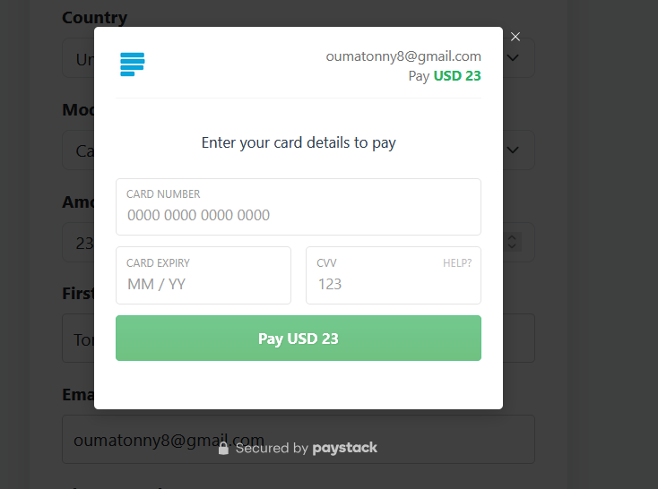

# CISNE SOFTWARES - Payment System

A payment integration system using Paystack for processing payments.

**Production URL:** [https://chisnepayment.chisne.co.ke/](https://chisnepayment.chisne.co.ke/)

## Features

- Simple and intuitive payment form
- Secure payment processing with Paystack
- Automatic form data transfer to payment gateway
- Transaction verification

## Deployment Instructions

### Local Development

1. Clone the repository to your local environment
2. Copy `configs.php.example` to `configs.php` and add your Paystack API keys
3. Ensure your web server (Apache, Nginx, etc.) is configured to process PHP files
4. Access the application through your local web server

### Production Deployment

1. Upload all files to your production server
2. Make sure `.htaccess` file is properly uploaded to protect sensitive files
3. Update `configs.php` with your production Paystack API keys
4. Ensure your server has PHP installed and configured
5. Set appropriate file permissions:
   - All directories: 755
   - All files: 644
   - No execute permissions needed for any files
6. Uncomment the HTTPS redirection rules in `.htaccess` if your site has SSL

### Security Notes

- The `.htaccess` file prevents direct access to `configs.php`
- Consider using environment variables for API keys in production
- Always use HTTPS in production to secure data transmission
- Regularly update your server and PHP to the latest secure versions

## Troubleshooting

If you encounter issues with the payment system:

1. Check that your Paystack API keys are correct
2. Verify that your server meets all requirements for Paystack integration
3. Check server logs for any PHP errors
4. Ensure all files were uploaded correctly

## License

[Your License Information]
